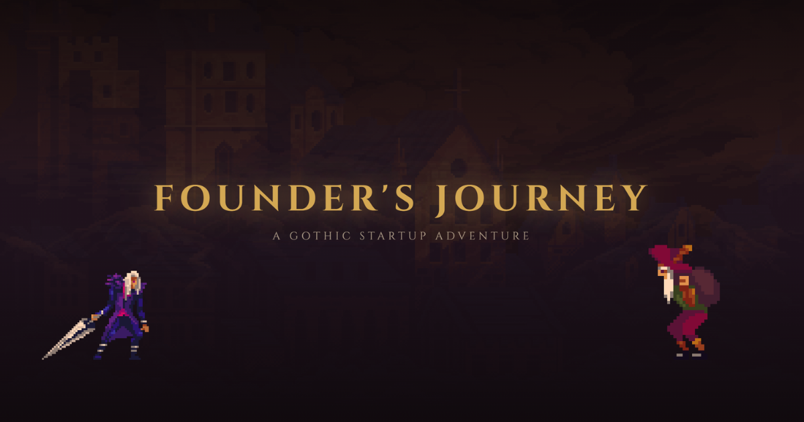

# Founder's Journey



A gothic-themed startup simulation game combining narrative decisions, resource management, and 2D platformer gameplay.

**[Play the game](https://hannestayronen.com/foundergame)**

## About

Founder's Journey is a course project for Game Development at GMIT (Spring 2026). The player takes on the role of a university student navigating the path from campus life to building a startup — making strategic decisions that affect four key resources: Momentum, Energy, Money, and Reputation.

The game features 8 levels across 5 phases, with branching narrative choices, mini-challenges (quick-time events and falling-catch games), collectibles, enemies, and multiple endings. A full playthrough takes 15–30 minutes.

See [GAME_DESIGN_DOCUMENT.md](GAME_DESIGN_DOCUMENT.md) for the full game design specification.

## AI Attribution

The source code for this project was **mostly generated using [Claude Code](https://docs.anthropic.com/en/docs/claude-code)**, an AI pair programming tool by Anthropic.

**All game design, narrative, mechanics, creative direction, and decision-making were done by Hannes Täyrönen.** The Game Design Document ([GAME_DESIGN_DOCUMENT.md](GAME_DESIGN_DOCUMENT.md)) was written entirely by the author and served as the authoritative specification throughout development. Claude Code was used as an implementation tool — translating design decisions into working code.

## Tech Stack

- **Framework:** React 19 + TypeScript
- **Build:** Vite 7
- **Styling:** Tailwind CSS v4
- **State Management:** React Context + useReducer (3 contexts: game logic, visual/scene, variety system)
- **Sound Effects:** jsfxr
- **Music:** Royalty-free (Kevin MacLeod)
- **Deployment:** Vercel

## Running Locally

```bash
git clone https://github.com/hanski-t/founder_game.git
cd founder_game
npm install
npm run dev
```

Other commands:
- `npm run build` — production build
- `npm run lint` — run ESLint
- `npm run preview` — preview production build locally

## Project Structure

```
src/
├── screens/          # Main game screens (start, game, end)
├── components/       # UI components organized by function
│   ├── character/    # Player sprite and animation
│   ├── scene/        # Parallax backgrounds, ground, atmosphere
│   ├── overlay/      # Decision panels, outcome panels, pause menu
│   ├── hud/          # Resource display, collection sidebar
│   ├── collectibles/ # Pickup items and animations
│   ├── challenges/   # QTE and falling-catch mini-games
│   ├── enemies/      # Enemy sprites and behavior
│   ├── obstacles/    # Static obstacle rendering
│   ├── platforms/    # Moving platforms
│   └── transitions/  # Scene transitions, phase titles
├── context/          # React Context providers (game, scene, variety)
├── hooks/            # Custom hooks (movement, physics, camera)
├── data/             # Game data (decisions, scenes, configs)
├── types/            # TypeScript type definitions
├── utils/            # Utility functions (collision, save/load, scores)
├── audio/            # Sound and music managers
└── assets/used/      # Game assets (sprites, tilesets, backgrounds)
```

## Controls

| Input | Action |
|-------|--------|
| WASD / Arrow Keys | Move left/right |
| Space | Jump |
| Enter / Click | Interact with NPCs, select choices |
| Escape | Pause menu |

## Assets & Credits

- **Pixel Art:** [Gothicvania Patreon Collection](https://ansimuz.itch.io/gothicvania-patreon-collection) by Ansimuz
- **Music:** Kevin MacLeod (incompetech.com) — royalty-free
- **Sound Effects:** Generated with [jsfxr](https://github.com/AmbientRun/jsfxr)


## License

This project is licensed under the [MIT License](LICENSE).
